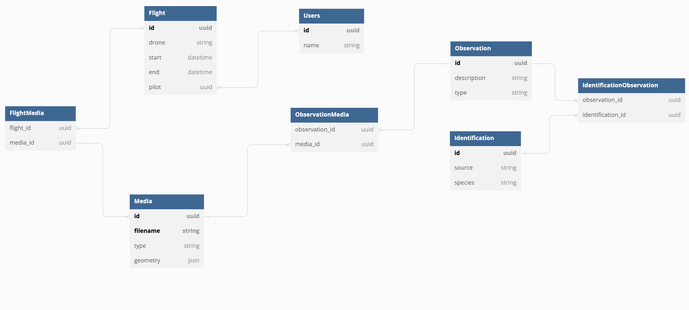

# Aviary

## Commands

To start
```
docker-compose up -d --build
```

To stop
```
docker-compose down
```

To perform db migrations
```
docker exec -it aviary-web-1 python manage.py makemigrations


docker exec aviary-web-1 python manage.py migrate
```


To change user password. Note username and password are case-sensitive.
```
docker exec aviary-web-1 python manage.py changepassword <username>
```


To create a new admin user:
```
docker exec -it aviary-web-1 sh python manage.py createsuperuser --username=<username>
```

## Instructions

Once you have started the database, you can view the admin dashboard by going to http://localhost:8000/admin/. This will require login using a superuser account, which can be created using the command described above.

Once here you can manually create entries, particularly for Observations and Identifications. The [Birdkeeper import script](../importer) can be used to automatically create Flight and Media from a drone sd card.

## Exporting GeoJSON

To export data in the GeoJSON format for import into GIS tools the following endpoints can be used.


http://localhost:8000/aviary/export/flight/<flight_id> - will create a rough flightpath of the drone flight from the videos recorded during the flight.

http://localhost:8000/aviary/export/observations?flight=<flight_id> - will export all observations or if the optional `?flight=<flight_id>` query parameter is set will export only the observations linked to media from a specific flight.

## Database schema

The layout of tables in the database is shown below. 

##### Media
As the name suggests, Media is any photo, video, or audio that was recorded and is entered into the database. 

##### Flight
Flights are created automatically by the import script, or can also be created manually, and are used to store metadata from the flight of a drone and link a drone flight to media recorded. 

##### Observation
An Observation is anything of note that has been noticed in the media and should be investigated further for identification. An observation can be linked to multiple medias showing the same thing (i.e. if there is a video and a photo that captured a monkey).

##### Identification
An Identification is a confirmed identification of a species based on an Observation. An Identification can be linked to one or more Observations. Ideally there would be a single identification created for each species, with IdentificationObservation linking entries for each observation that supported that Indentification. The source field is used to record the method of validating the identification (i.e. iNaturalist).




